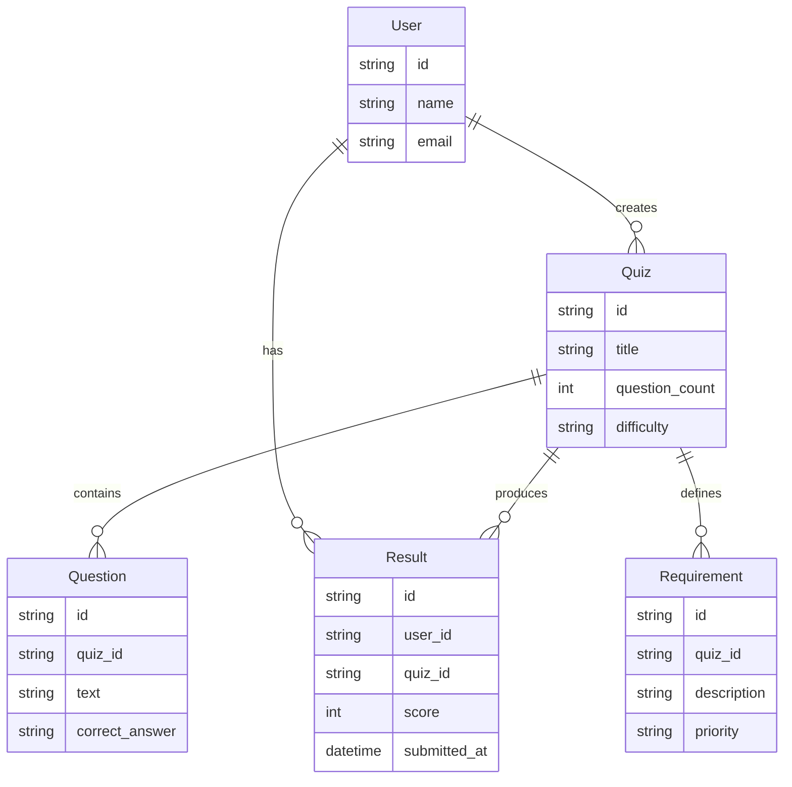

# Goal

Build API that serves the following front-end : https://github.com/Nazek-Altayeb/Quiz-Frontend.
It provides the Front-end with required data, which should be loaded from Open-TRIVIA in real time, Complies with end user inputs.

# System design

The database for this project is relational. Currently it consists of two tables (Quiz, Questions).

## Workflow:

- The frontend sends quiz parameters: number of questions, category, and difficulty.

- The backend uses these parameters to fetch questions from Open Trivia DB (https://opentdb.com/api_config.php).

- The fetched data is temporarily stored in the PostgreSQL database.

- The data is then served to the frontend.

## Architecture Extension Plan
To make the system more professional, scalable, and CMS-ready, I plan to gradually extend the system to include:

- User management

- Persistent quiz history

- Admin interfaces for custom question entry

- Question categories, tags, and metadata

- CMS functionality for school use (e.g. tracking, reporting)

# Development

## Requirements & Implementation Roadmap
Each “Requirement” is grouped by relevance and development priority using the MoSCoW method.

### Requirement 1: Basic Functionality
- [x] [Setup environment] <code style="color:red">(Must have)</code>
- [x] [Load quiz parameters from frontend] <code style="color:red">(Must have)</code>
- [x] [Fetch questions from Open Trivia Encyclopedia] <code style="color:red">(Must have)</code>
- [x] [Send questions to frontend] <code style="color:red">(Must have)</code>

### Requirement 2: User Management
- [] [Create User table ] <code style="color:red">(could have)</code> 
- [] [Implement CRUD operations for User] <code style="color:red">(could have)</code> 

### Requirement 3: CMS Foundations
- [] [Allow custom question entry by admin ] <code style="color:orange">(Should have)</code>
- [] [Store completed quizzes with user reference] <code style="color:orange">(Should have)</code>
- [] [Add user roles and permissions (admin, student)] <code style="color:orange">(Should have)</code>

